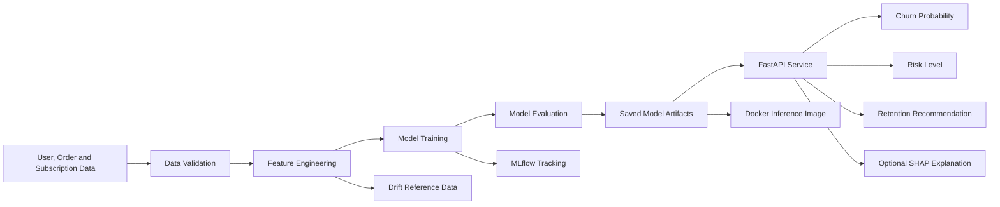

<div align="center">

# 🥗 Haett MLOps Churn Prediction System

### Production-style customer churn prediction for a healthy meal subscription platform

[](https://github.com/VijayaKumarchinta/Haett_MLOps_Intern_Assessment_/actions/workflows/ci.yml)
[](https://www.python.org/)
[](https://fastapi.tiangolo.com/)
[](https://www.docker.com/)
[](https://mlflow.org/)
[](https://scikit-learn.org/)
[](#-testing-and-code-quality)
[](https://shap.readthedocs.io/)

<br>

**Data Engineering · Machine Learning · Experiment Tracking · FastAPI · Docker · Testing · Monitoring**

[Overview](#-overview) •
[Architecture](#-architecture) •
[Quick Start](#-quick-start) •
[API](#-api-endpoints) •
[Test Cases](#-three-api-test-cases) •
[Docker](#-docker-deployment) •
[Results](#-final-model-results)

</div>

---

## 📌 Overview

Haett is a subscription-based healthy meal delivery platform. This project predicts whether an active customer is likely to stop ordering or fail to renew their subscription within the next **30 days**.

The system returns:

| Output | Description |
|---|---|
| `churn_probability` | Probability that the customer will churn |
| `risk_level` | `Low`, `Medium`, or `High` risk |
| `business_recommendation` | Actionable retention recommendation |
| `explanations` | Optional SHAP feature contributions |

The implementation includes a complete ML lifecycle:

```text
Data generation → Validation → Feature engineering → Training
→ MLflow tracking → Model artifacts → FastAPI → Docker
→ Tests → Drift monitoring
```

---

## ✨ Key Features

- **End-to-end ML pipeline** with reusable modules
- **30 engineered features** across customer activity, orders, subscriptions, and engagement
- **Three candidate models:** Logistic Regression, Random Forest, and XGBoost
- **MLflow experiment tracking** for parameters, metrics, and artifacts
- **FastAPI inference service** with single and batch endpoints
- **Pydantic validation** with cross-field business rules
- **SHAP explainability** for supported single predictions
- **Risk-based retention recommendations**
- **Lightweight Docker deployment** using pre-trained artifacts
- **Automated test suite:** 45 passing tests
- **GitHub Actions CI**
- **Reference-based drift monitoring**

---

## 🏗 Architecture



### Training and inference are separated

| Workflow | Responsibility |
|---|---|
| Training | Generate data, preprocess, engineer features, train models, evaluate, and save artifacts |
| Inference | Load existing model artifacts and serve predictions |
| Docker build | Package the API and trained artifacts without retraining |
| Monitoring | Compare incoming data with stored reference distributions |

---

## 📊 Final Model Results

The training pipeline compares Logistic Regression, Random Forest, and XGBoost.

| Metric | Final value |
|---|---:|
| **Selected model** | **Logistic Regression** |
| F1 score | 0.2695 |
| ROC-AUC | 0.7519 |
| PR-AUC | 0.1779 |
| Precision | 0.1939 |
| Recall | 0.4419 |
| Optimal threshold | 0.1518 |

> The churn dataset is intentionally imbalanced. For this reason, PR-AUC, recall, F1 score, Brier score, and lift are considered alongside ROC-AUC.

---

## 🧠 Feature Engineering

The model uses **30 engineered features**.

| Group | Example features |
|---|---|
| Recency | `days_since_last_order`, `tenure_days` |
| Frequency | `total_orders`, `orders_last_30_days` |
| Consistency | `std_days_between_orders` |
| Monetary | `avg_order_value`, `avg_rating` |
| Coupon behavior | `coupon_usage_count`, `coupon_usage_rate` |
| Subscription | `subscription_tenure_days`, `monthly_price`, `n_plan_changes` |
| Engagement | `avg_app_logins`, `avg_meals_skipped`, `total_support_tickets` |
| Demographics | `age`, `age_group_code`, encoded categorical features |

Potential leakage fields such as cancellation status and cancellation reason are excluded from training.

---

## 🗂 Project Structure

```text
.
├── .github/
│   └── workflows/                 # GitHub Actions CI
├── data/                          # Raw, processed, and feature data
├── models/                        # Deployment model artifacts
├── monitoring/                    # Drift reference data and reports
├── screenshots/                   # MLflow and assessment evidence
├── scripts/                       # Utility scripts
├── src/
│   ├── api/                       # FastAPI application
│   ├── data/                      # Data generation and preprocessing
│   ├── models/                    # Training and prediction modules
│   ├── monitoring/                # Drift detection
│   └── utils/                     # Configuration and metrics
├── tests/                         # Automated test suite
├── Dockerfile                     # Lightweight inference image
├── docker-compose.yml             # API and MLflow services
├── requirements.txt               # Training dependencies
├── requirements-api.txt           # Inference dependencies
├── requirements-dev.txt           # Development and test dependencies
└── README.md
```

---

## ⚡ Quick Start

### Prerequisites

- Python 3.11+
- pip
- Docker and Docker Compose for containerized execution

### Clone the repository

```bash
git clone https://github.com/VijayaKumarchinta/Haett_MLOps_Intern_Assessment_.git
cd Haett_MLOps_Intern_Assessment_
```

### Create a virtual environment

```bash
python -m venv .venv
```

Linux or macOS:

```bash
source .venv/bin/activate
```

Windows PowerShell:

```powershell
.venv\Scripts\Activate.ps1
```

### Install dependencies

```bash
python -m pip install --upgrade pip
python -m pip install -r requirements-dev.txt
```

---

## 🔄 Run the Training Pipeline

```bash
python src/run_pipeline.py
```

The pipeline:

1. Generates realistic synthetic customer behavior.
2. Validates and cleans the data.
3. Creates churn-prediction features.
4. Trains multiple models.
5. Evaluates model performance.
6. Logs experiments to MLflow.
7. Saves the final deployment artifacts.
8. Stores reference data for drift monitoring.

### Deployment artifacts

```text
models/
├── churn_model.pkl
├── tuned_model.pkl
├── scaler.pkl
├── feature_names.txt
├── optimal_threshold.txt
└── model_metadata.json
```

---

## 📈 MLflow Experiment Tracking

Start the MLflow UI:

```bash
mlflow ui \
  --backend-store-uri mlruns \
  --host 0.0.0.0 \
  --port 5000
```

Open:

```text
http://localhost:5000
```

Tracked items include:

- hyperparameters
- evaluation metrics
- optimal classification threshold
- feature-importance artifacts
- serialized model artifacts

---

## 🚀 Run the API Locally

```bash
python -m uvicorn src.api.main:app \
  --host 0.0.0.0 \
  --port 8000
```

Swagger documentation:

```text
http://localhost:8000/docs
```

---

## 🔌 API Endpoints

| Method | Endpoint | Purpose |
|---|---|---|
| `GET` | `/` | Service information |
| `GET` | `/health` | API and model health |
| `POST` | `/predict` | Single-user prediction |
| `POST` | `/predict?explain=true` | Prediction with SHAP explanations |
| `POST` | `/predict/batch` | Vectorized batch predictions |
| `GET` | `/docs` | Interactive Swagger documentation |

---

## 🧪 Three API Test Cases

### Test Case 1 — Health check

**Purpose:** Verify that the API is running and that the model loaded successfully.

```bash
curl -sS http://localhost:8000/health | python -m json.tool
```

Expected result:

```json
{
  "status": "healthy",
  "model_loaded": true,
  "version": "1.0.0"
}
```

---

### Test Case 2 — Valid low-risk prediction with SHAP

**Purpose:** Verify prediction, risk classification, recommendation, and explainability.

```bash
curl -sS \
  -X POST \
  "http://localhost:8000/predict?explain=true" \
  -H "Content-Type: application/json" \
  -d '{
    "user_id": 101,
    "days_since_last_order": 20,
    "tenure_days": 365,
    "total_orders": 42,
    "std_days_between_orders": 4.2,
    "orders_last_30_days": 2,
    "avg_order_value": 32.5,
    "avg_rating": 3.8,
    "coupon_usage_count": 8,
    "coupon_usage_rate": 0.19,
    "n_plan_changes": 1,
    "monthly_price": 89.99,
    "subscription_tenure_days": 300,
    "avg_app_logins": 3.5,
    "avg_meals_skipped": 1.2,
    "total_support_tickets": 2,
    "age": 29,
    "age_group_code": 1
  }' | python -m json.tool
```

Verified example:

```json
{
  "user_id": 101,
  "churn_probability": 0.0337,
  "risk_level": "Low",
  "business_recommendation": "Low risk. User is in good standing.",
  "explanations": [
    {
      "feature": "avg_meals_skipped",
      "value": 1.2,
      "impact": -0.6561
    }
  ]
}
```

> The complete response contains up to five feature explanations. Exact values depend on the committed model artifacts.

---

### Test Case 3 — Invalid business-rule input

**Purpose:** Confirm that Pydantic rejects logically inconsistent input.

This request is invalid because `orders_last_30_days` is greater than `total_orders`.

```bash
curl -sS \
  -X POST \
  "http://localhost:8000/predict" \
  -H "Content-Type: application/json" \
  -d '{
    "user_id": 999,
    "total_orders": 2,
    "orders_last_30_days": 8,
    "age": 30
  }' | python -m json.tool
```

Expected result:

```text
HTTP 422 Unprocessable Entity
```

The validation response explains:

```text
orders_last_30_days cannot exceed total_orders
```

---

## 📦 Batch Prediction

```bash
curl -sS \
  -X POST \
  "http://localhost:8000/predict/batch" \
  -H "Content-Type: application/json" \
  -d '{
    "users": [
      {
        "user_id": 201,
        "age": 29
      },
      {
        "user_id": 202,
        "age": 40
      }
    ]
  }' | python -m json.tool
```

Batch predictions are vectorized and skip SHAP computation to reduce latency.

---

## 🐳 Docker Deployment

### Build the API image

```bash
docker compose build api
```

### Start the API

```bash
docker compose up -d api
```

### Wait for the container to become healthy

```bash
until [ "$(docker inspect -f '{{.State.Health.Status}}' haett-churn-api 2>/dev/null)" = "healthy" ]; do
  echo "Waiting for API startup..."
  sleep 2
done
```

### Verify the service

```bash
curl -sS http://localhost:8000/health | python -m json.tool
```

### Start API and MLflow together

```bash
docker compose up -d
```

### Stop services

```bash
docker compose down
```

### Docker design

- Model training is not executed during image build.
- The image packages the already-trained deployment artifacts.
- The API runs as a non-root user.
- A Docker health check verifies `/health`.
- Docker Compose does not replace the packaged model directory with an empty bind mount.

---

## ✅ Testing and Code Quality

Run formatting, linting, and tests:

```bash
python -m black --check src tests
python -m ruff check src tests
python -m pytest tests -v
```

Current verified result:

```text
45 passed
```

### Test coverage areas

- health and root endpoints
- single-user prediction
- SHAP response behavior
- batch prediction
- missing-model handling
- input-range and business-rule validation
- feature engineering
- classification metrics
- risk-level mapping
- business recommendations
- drift reference creation
- drift report generation

---

## 🔍 Explainability

SHAP explanations are generated:

- when `POST /predict?explain=true` is requested
- for selected High-Risk single-user predictions when explanation signals are needed for a targeted recommendation

Batch prediction intentionally skips SHAP to keep latency low.

---

## 📡 Drift Monitoring

The project stores reference feature data and includes utilities for comparing future inference data against the training baseline.

Monitoring implementation:

```text
src/monitoring/drift_detection.py
```

Generated monitoring reports are runtime artifacts and should not be treated as source code.

---

## 🎯 Assessment Coverage

| Requirement | Status |
|---|:---:|
| Data preparation | ✅ |
| Feature engineering | ✅ |
| Multiple models | ✅ |
| Model evaluation | ✅ |
| MLflow experiment tracking | ✅ |
| FastAPI deployment | ✅ |
| Input validation | ✅ |
| Business recommendations | ✅ |
| Dockerized inference | ✅ |
| Automated testing | ✅ |
| GitHub Actions | ✅ |
| SHAP explainability | ✅ |
| Drift-monitoring utilities | ✅ |

---

## ⚠️ Assumptions and Limitations

### Assumptions

- Churn means no order or subscription renewal during the next 30 days.
- The synthetic dataset represents realistic meal-subscription behavior.
- Risk levels use the optimal threshold generated during training.
- `user_id` is excluded from model input and used only in the API response.
- Missing model features are aligned to the stored training schema.

### Limitations

- The dataset is synthetic and should be replaced or supplemented with production data.
- Drift monitoring currently runs as an offline utility.
- Production authentication, rate limiting, and persistent prediction logging are outside the assessment scope.
- MLflow Model Registry promotion can be added as a future enhancement.
- Final model-selection methodology can be improved with stricter validation/test separation.

---

## 🛣 Roadmap

- [ ] Register and promote the final model through MLflow Model Registry
- [ ] Add scheduled drift checks and alerting
- [ ] Add cloud deployment
- [ ] Add centralized logs and prediction monitoring
- [ ] Add authentication and rate limiting
- [ ] Track retention interventions and outcomes
- [ ] Add automated retraining triggers

---

## 👨‍💻 Author

<div align="center">

**Vijaya Kumar Chinta**

[](https://github.com/VijayaKumarchinta)

Built as part of the **Haett MLOps Internship Assessment**.

</div>