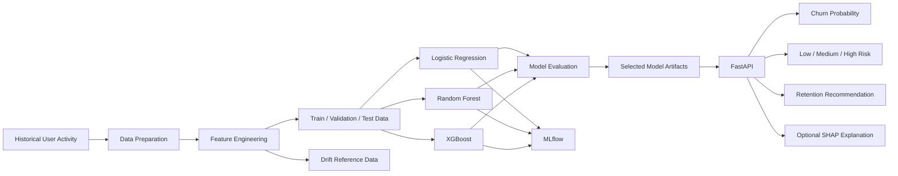

<div align="center">

# 🥗 Haett Churn Prediction — MLOps Assessment

### End-to-end churn prediction for a subscription-based healthy meal delivery platform

[](https://github.com/VijayaKumarchinta/Haett_MLOps_Intern_Assessment_/actions/workflows/ci.yml)
[](https://www.python.org/)
[](https://fastapi.tiangolo.com/)
[](https://mlflow.org/)
[](https://www.docker.com/)
[](https://scikit-learn.org/)
[](#-testing)
[](https://shap.readthedocs.io/)
[](#-assessment-requirement-mapping)

<br>

**Data Preparation · Feature Engineering · Model Training · MLflow · FastAPI · Docker · Testing · Monitoring**

[Objective](#-objective) •
[Requirements](#-assessment-requirement-mapping) •
[Architecture](#-architecture) •
[Setup](#-setup) •
[API Tests](#-three-api-test-cases) •
[Docker](#-docker-deployment)

</div>

---

## 🎯 Objective

Haett is a subscription-based healthy meal delivery platform. The goal of this assessment is to build an end-to-end machine learning system that predicts whether an **active user is likely to churn within the next 30 days**.

A user is considered churned when they:

- stop ordering meals during the prediction window, or
- do not renew their subscription during that period.

The deployed API returns:

```json
{
  "churn_probability": 0.87,
  "risk_level": "High"
}
```

This implementation also returns an actionable retention recommendation and can optionally include SHAP feature explanations.

---

## ✅ Assessment Requirement Mapping

The README is organized around the six mandatory sections in the assessment.

| Assessment requirement | Implementation | Status |
|---|---|:---:|
| 1. Data preparation | Synthetic historical user, order, subscription, and engagement data | ✅ |
| 2. Feature engineering | Recency, frequency, monetary, subscription, coupon, meal-swap, and consistency features | ✅ |
| 3. Model training | Logistic Regression, Random Forest, and XGBoost with classification metrics | ✅ |
| 4. MLflow tracking | Parameters, metrics, plots, and model artifacts logged | ✅ |
| Registered best model | Final model is saved and deployed; formal MLflow Registry promotion is not yet implemented | ⚠️ |
| 5. FastAPI prediction API | `POST /predict`, validation, health endpoint, and batch prediction | ✅ |
| 6. Business recommendation | High-risk users receive a retention action based on risk signals | ✅ |
| Dockerized application | Lightweight inference image with health check | ✅ |
| Modular code | Separate data, model, API, monitoring, and utility modules | ✅ |
| Basic testing | 45 automated tests | ✅ |
| Clear documentation | Setup, design decisions, requests, responses, and limitations | ✅ |

> **Transparent limitation:** the assessment asks for a registered best model. The current solution logs MLflow experiments and saves the selected deployment artifact, but automatic registration/promotion through the MLflow Model Registry remains a documented future improvement.

---

## 🏗 Architecture



### Training and inference separation

| Workflow | Responsibility |
|---|---|
| Training pipeline | Generate data, preprocess, engineer features, train models, evaluate, and save artifacts |
| MLflow | Store experiment parameters, metrics, plots, and serialized model artifacts |
| Inference API | Load existing artifacts and serve predictions |
| Docker image | Package only the API, runtime dependencies, and pre-trained artifacts |
| Monitoring | Compare new feature data with a saved reference distribution |

The Docker image **does not retrain the models during build**.

---

# 1️⃣ Data Preparation

## Dataset strategy

The project uses realistic synthetic data representing:

- user profiles
- meal orders
- subscription history
- app engagement
- support activity
- coupon behavior
- meal skipping or swapping behavior

The generated data is intended to approximate a subscription meal-delivery business when private production data is unavailable.

## Pipeline stages

| Stage | Module | Output |
|---|---|---|
| Generate data | `src/data/generate_data.py` | `data/raw/` |
| Clean and validate | `src/data/preprocess.py` | `data/processed/` |
| Build features | `src/data/feature_engineering.py` | `data/features/` |
| Train and evaluate | `src/models/train.py` | `models/`, `mlruns/` |
| Orchestrate pipeline | `src/run_pipeline.py` | Complete pipeline execution |

## Data assumptions

- The prediction horizon is 30 days.
- Users are active at the feature snapshot date.
- The churn target is generated from future behavior, not from features available after churn.
- Missing or optional inference features are aligned to the trained schema.
- Synthetic data is used only because production Haett data was not provided.

## Leakage prevention

Fields that directly reveal cancellation or post-churn behavior are excluded, including:

- cancellation indicators
- cancellation reasons
- days since cancellation
- other fields that become known only after the target event

---

# 2️⃣ Feature Engineering

The assessment recommends seven core behavior signals. All seven are represented.

| Required example | Implemented feature |
|---|---|
| Days since last order | `days_since_last_order` |
| Orders in last 30 days | `orders_last_30_days` |
| Average order value | `avg_order_value` |
| Subscription duration | `subscription_tenure_days` |
| Coupon usage | `coupon_usage_count`, `coupon_usage_rate` |
| Meal swap frequency | `avg_meals_skipped` |
| Order consistency | `std_days_between_orders` |

## Feature groups

| Group | Examples |
|---|---|
| Recency | `days_since_last_order`, `tenure_days` |
| Frequency | `total_orders`, `orders_last_30_days` |
| Consistency | `std_days_between_orders` |
| Monetary | `avg_order_value`, `avg_rating` |
| Coupon behavior | `coupon_usage_count`, `coupon_usage_rate` |
| Subscription | `subscription_tenure_days`, `monthly_price`, `n_plan_changes` |
| Engagement | `avg_app_logins`, `avg_meals_skipped`, `total_support_tickets` |
| Demographic and acquisition | `age`, `age_group_code`, encoded categorical fields |

The final training matrix contains **30 features**, including encoded categorical variables.

---

# 3️⃣ Model Training and Evaluation

## Candidate models

The pipeline trains and compares:

1. Logistic Regression
2. Random Forest
3. XGBoost

## Evaluation metrics

Because churn is an imbalanced classification problem, the project reports:

- Precision
- Recall
- F1 score
- ROC-AUC
- PR-AUC
- Balanced accuracy
- Brier score
- Lift at 10%
- Lift at 20%
- Optimal classification threshold

## Final selected model

| Metric | Value |
|---|---:|
| Selected model | **Logistic Regression** |
| Accuracy | 0.7940 |
| Balanced accuracy | 0.6345 |
| Precision | 0.1939 |
| Recall | 0.4419 |
| F1 score | 0.2695 |
| ROC-AUC | 0.7519 |
| PR-AUC | 0.1779 |
| Brier score | 0.0742 |
| Lift at 10% | 1.8605 |
| Lift at 20% | 2.3256 |
| Optimal threshold | 0.1518 |

> These values correspond to the committed deployment artifacts. Regenerating the synthetic dataset or retraining may produce slightly different results.

## Saved artifacts

```text
models/
├── churn_model.pkl
├── tuned_model.pkl
├── scaler.pkl
├── feature_names.txt
├── optimal_threshold.txt
└── model_metadata.json
```

---

# 4️⃣ MLflow Experiment Tracking

MLflow is used to track:

- model name
- hyperparameters
- evaluation metrics
- optimal threshold
- feature-importance artifacts
- serialized model artifacts
- comparison across candidate models

Start the MLflow interface:

```bash
mlflow ui \
  --backend-store-uri mlruns \
  --host 0.0.0.0 \
  --port 5000
```

Open:

```text
http://localhost:5000
```

## Model versioning status

The selected artifact is stored in `models/` and packaged into the inference image.

Formal MLflow Model Registry registration and alias-based promotion, such as a `champion` alias, are not yet automated. This is listed under [Future Improvements](#-future-improvements), in line with the assessment instruction to clearly document incomplete items.

---

# 5️⃣ Prediction API

The FastAPI service validates input, aligns features to the trained schema, loads the model once during application startup, and handles unavailable artifacts with appropriate service errors.

## Endpoints

| Method | Endpoint | Purpose |
|---|---|---|
| `GET` | `/` | API metadata and links |
| `GET` | `/health` | Service and model health |
| `POST` | `/predict` | Single-user prediction |
| `POST` | `/predict?explain=true` | Prediction with SHAP explanations |
| `POST` | `/predict/batch` | Batch prediction for up to 1,000 users |
| `GET` | `/docs` | Swagger UI |

## Response structure

```json
{
  "user_id": 101,
  "churn_probability": 0.0337,
  "risk_level": "Low",
  "business_recommendation": "Low risk. User is in good standing.",
  "explanations": []
}
```

## Input validation

Pydantic validation covers:

- non-negative numerical fields
- age range
- rating range
- coupon usage rate range
- valid age-group code
- `orders_last_30_days <= total_orders`
- `coupon_usage_count <= total_orders`
- `subscription_tenure_days <= tenure_days`
- `days_since_last_order <= tenure_days` when tenure is positive
- rejection of unknown request fields

Invalid requests return a structured HTTP `422` response.

---

# 6️⃣ Business Recommendation

Prediction alone is not treated as the final output.

The recommendation layer uses:

- churn probability
- Low, Medium, or High risk
- optimal threshold
- available SHAP risk signals

Examples of retention actions include:

| User condition | Example action |
|---|---|
| High price sensitivity | Offer a targeted discount |
| Poor meal fit or high skipping | Recommend alternative meals |
| Early subscription churn risk | Improve onboarding and offer a short trial extension |
| Plan mismatch | Suggest a more suitable subscription plan |
| Low app engagement | Send a personalized notification |
| Repeated support issues | Trigger proactive customer-support outreach |

High-risk users receive the strongest retention action. Low-risk users generally receive no urgent intervention.

---

## 🗂 Project Structure

```text
.
├── .github/
│   └── workflows/
│       └── ci.yml
├── data/
│   ├── raw/
│   ├── processed/
│   └── features/
├── models/
├── monitoring/
│   └── reference/
├── screenshots/
├── scripts/
├── src/
│   ├── api/
│   ├── data/
│   ├── models/
│   ├── monitoring/
│   ├── utils/
│   └── run_pipeline.py
├── tests/
├── Dockerfile
├── docker-compose.yml
├── requirements.txt
├── requirements-api.txt
├── requirements-dev.txt
└── README.md
```

---

## ⚡ Setup

### Prerequisites

- Python 3.11+
- pip
- Docker and Docker Compose for containerized execution

### Clone

```bash
git clone https://github.com/VijayaKumarchinta/Haett_MLOps_Intern_Assessment_.git
cd Haett_MLOps_Intern_Assessment_
```

### Create a virtual environment

```bash
python -m venv .venv
```

Linux or macOS:

```bash
source .venv/bin/activate
```

Windows PowerShell:

```powershell
.venv\Scripts\Activate.ps1
```

### Install dependencies

For training, tests, and local development:

```bash
python -m pip install --upgrade pip
python -m pip install -r requirements-dev.txt
```

For inference-only environments:

```bash
python -m pip install -r requirements-api.txt
```

---

## ▶️ Run the Pipeline

```bash
python src/run_pipeline.py
```

The command:

1. generates synthetic historical behavior
2. preprocesses the source tables
3. builds the feature matrix
4. trains candidate models
5. evaluates each model
6. logs experiments to MLflow
7. saves the selected deployment artifacts
8. saves reference data for drift monitoring

---

## 🚀 Run the API Locally

```bash
python -m uvicorn src.api.main:app \
  --host 0.0.0.0 \
  --port 8000
```

Open:

```text
Swagger UI: http://localhost:8000/docs
Health:     http://localhost:8000/health
```

---

## 🧪 Three API Test Cases

These tests map directly to the expected assessment behavior: a churn probability, a risk classification, a recommendation for an at-risk user, and graceful validation of invalid input.

### Test Case 1 — Low-risk active customer

```bash
curl -sS \
  -X POST \
  "http://localhost:8000/predict?explain=true" \
  -H "Content-Type: application/json" \
  -d '{
    "user_id": 101,
    "days_since_last_order": 20,
    "tenure_days": 365,
    "total_orders": 42,
    "std_days_between_orders": 4.2,
    "orders_last_30_days": 2,
    "avg_order_value": 32.5,
    "avg_rating": 3.8,
    "coupon_usage_count": 8,
    "coupon_usage_rate": 0.19,
    "n_plan_changes": 1,
    "monthly_price": 89.99,
    "subscription_tenure_days": 300,
    "avg_app_logins": 3.5,
    "avg_meals_skipped": 1.2,
    "total_support_tickets": 2,
    "age": 29,
    "age_group_code": 1
  }' | python -m json.tool
```

Verified output from the committed model:

```json
{
  "user_id": 101,
  "churn_probability": 0.0337,
  "risk_level": "Low",
  "business_recommendation": "Low risk. User is in good standing.",
  "explanations": [
    {
      "feature": "avg_meals_skipped",
      "value": 1.2,
      "impact": -0.6561
    }
  ]
}
```

The real response may contain up to five explanation entries and a longer recommendation.

---

### Test Case 2 — At-risk customer requiring retention action

```bash
curl -sS \
  -X POST \
  "http://localhost:8000/predict?explain=true" \
  -H "Content-Type: application/json" \
  -d '{
    "user_id": 202,
    "days_since_last_order": 120,
    "tenure_days": 180,
    "total_orders": 8,
    "std_days_between_orders": 20,
    "orders_last_30_days": 0,
    "avg_order_value": 20,
    "avg_rating": 1.5,
    "coupon_usage_count": 6,
    "coupon_usage_rate": 0.75,
    "n_plan_changes": 4,
    "monthly_price": 129.99,
    "subscription_tenure_days": 60,
    "avg_app_logins": 0.1,
    "avg_meals_skipped": 6,
    "total_support_tickets": 10,
    "age": 24,
    "age_group_code": 0
  }' | python -m json.tool
```

Expected behavior:

- an elevated churn probability
- a `Medium` or `High` risk classification based on the trained threshold
- a targeted retention recommendation
- SHAP explanations because `explain=true`

Example response structure:

```json
{
  "user_id": 202,
  "churn_probability": 0.78,
  "risk_level": "High",
  "business_recommendation": "Offer a targeted retention action based on the strongest risk signals.",
  "explanations": [
    {
      "feature": "days_since_last_order",
      "value": 120,
      "impact": 0.42
    }
  ]
}
```

> The probability and SHAP values shown above illustrate the expected structure. The actual values are generated by the committed model.

---

### Test Case 3 — Invalid request handled gracefully

This request is invalid because the number of orders in the last 30 days exceeds total lifetime orders.

```bash
curl -sS \
  -X POST \
  "http://localhost:8000/predict" \
  -H "Content-Type: application/json" \
  -d '{
    "user_id": 303,
    "total_orders": 2,
    "orders_last_30_days": 8,
    "age": 30
  }' | python -m json.tool
```

Expected result:

```text
HTTP 422 Unprocessable Entity
```

The response identifies the violated rule:

```text
orders_last_30_days cannot exceed total_orders
```

---

## 🐳 Docker Deployment

Build the lightweight inference image:

```bash
docker compose build api
```

Start the API:

```bash
docker compose up -d api
```

Wait for readiness:

```bash
until [ "$(docker inspect -f '{{.State.Health.Status}}' haett-churn-api 2>/dev/null)" = "healthy" ]; do
  echo "Waiting for API startup..."
  sleep 2
done
```

Verify:

```bash
curl -sS http://localhost:8000/health | python -m json.tool
```

Expected:

```json
{
  "status": "healthy",
  "model_loaded": true,
  "version": "1.0.0"
}
```

Start both API and MLflow:

```bash
docker compose up -d
```

Stop services:

```bash
docker compose down
```

---

## ✅ Testing

Run formatting, linting, and tests:

```bash
python -m black --check src tests
python -m ruff check src tests
python -m pytest tests -v
```

Verified result:

```text
45 passed
```

The tests cover:

- health and root endpoints
- single prediction
- optional SHAP response
- batch prediction
- missing-model behavior
- field and cross-field validation
- feature engineering
- evaluation metrics
- risk classification
- business recommendations
- drift reference creation
- drift report generation

---

## 🔍 Explainability

SHAP explanations are generated:

- when `POST /predict?explain=true` is called
- when selected high-risk single predictions need supporting risk signals

Batch inference skips SHAP to keep latency manageable.

---

## 📡 Drift Monitoring

Reference feature data is saved for comparison with future inference data.

Implementation:

```text
src/monitoring/drift_detection.py
```

The monitoring utilities support:

- saving reference datasets
- comparing new data against the reference
- generating drift reports
- identifying critical feature drift

This is implemented as an offline monitoring utility rather than a continuously scheduled production service.

---

## 🧰 Software Engineering and MLOps Practices

| Practice | Implementation |
|---|---|
| Reproducible setup | Separate training, development, and inference requirements |
| Modular architecture | Data, models, API, monitoring, and utilities separated |
| Input validation | Pydantic schemas and business-rule validators |
| Model loading | Singleton predictor loaded during API startup |
| Container security | Non-root Docker user |
| Health monitoring | Docker and API health checks |
| CI | GitHub Actions workflow |
| Testing | 45 automated tests |
| Explainability | SHAP |
| Drift detection | Reference-based monitoring |
| Documentation | Setup, design decisions, limitations, and examples |

---

## 🎁 Bonus Features

| Optional assessment item | Status |
|---|:---:|
| GitHub Actions CI/CD | ✅ |
| Data drift detection | ✅ |
| Monitoring and logging foundation | ✅ |
| SHAP explainability | ✅ |
| Feature Store with Feast | Not included |
| Airflow orchestration | Not included |
| Cloud deployment | Not included |

The optional items not included were intentionally excluded to prioritize clean architecture, reproducibility, and a working deployment.

---

## ⚠️ Assumptions and Design Decisions

1. **Synthetic data:** used because private Haett production data was not supplied.
2. **Thirty-day target:** represents whether a user stops ordering or fails to renew during the next 30 days.
3. **Imbalanced metrics:** PR-AUC, recall, F1, and lift are emphasized over accuracy alone.
4. **Optimal threshold:** risk classification uses the threshold saved during training.
5. **User ID exclusion:** `user_id` is returned by the API but is not used as a model feature.
6. **Pre-trained Docker artifact:** model training is separated from API image creation to reduce build time and improve deployment consistency.
7. **Batch performance:** SHAP is skipped during batch scoring.
8. **Graceful failure:** missing model artifacts result in a service-unavailable response.
9. **Registry limitation:** MLflow Registry promotion is documented as incomplete instead of being falsely claimed.

---

## 🚧 Known Limitations

- Synthetic data cannot fully represent real Haett customer behavior.
- The final model should be revalidated on production data.
- MLflow Model Registry registration and promotion are not yet automated.
- Drift checks are offline rather than scheduled continuously.
- Production authentication, rate limiting, centralized logs, and prediction auditing are outside the assessment scope.
- Model-selection methodology can be strengthened further with stricter validation and untouched final-test evaluation.

---

## 🛣 Future Improvements

- [ ] Register the selected model in MLflow Model Registry
- [ ] Add aliases such as `candidate` and `champion`
- [ ] Strengthen train-validation-test separation
- [ ] Add scheduled drift monitoring and alerts
- [ ] Add cloud deployment
- [ ] Add centralized prediction and application logging
- [ ] Add authentication and rate limiting
- [ ] Track retention actions and outcomes
- [ ] Trigger retraining based on drift or performance thresholds

---

## 📦 Submission Contents

The repository includes:

- [x] Complete source code
- [x] README with setup instructions
- [x] Docker configuration
- [x] MLflow screenshots and experiment results
- [x] Sample API requests and responses
- [x] Assumptions and design decisions
- [x] Automated tests
- [x] Saved deployment model artifacts
- [x] Drift-monitoring utilities
- [ ] Automated MLflow Model Registry promotion

---

## 👨‍💻 Author

<div align="center">

**Vijaya Kumar Chinta**

[](https://github.com/VijayaKumarchinta)

Built for the **Haett MLOps Internship Assessment**.

</div>