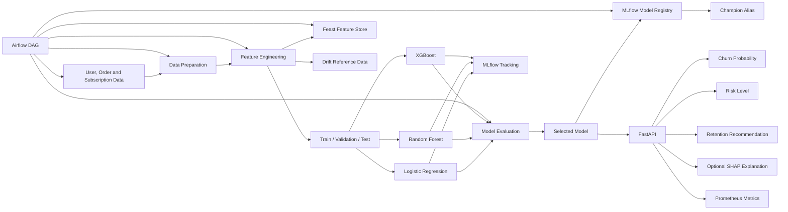

<div align="center">

# 🥗 Haett Churn Prediction — MLOps Assessment

### End-to-end customer churn prediction for a healthy meal subscription platform

[](https://github.com/VijayaKumarchinta/Haett_MLOps_Intern_Assessment_/actions/workflows/ci.yml)
[](https://www.python.org/)
[](https://fastapi.tiangolo.com/)
[](https://mlflow.org/)
[](https://feast.dev/)
[](https://airflow.apache.org/)
[](https://www.docker.com/)
[](#-testing-and-quality)
[](https://prometheus.io/)
[](https://shap.readthedocs.io/)

<br>

**Data Preparation · Feature Engineering · Model Training · MLflow Registry · FastAPI · Feast · Airflow · Monitoring**

[Objective](#-objective) •
[Requirements](#-assessment-requirement-mapping) •
[Architecture](#-architecture) •
[Setup](#-local-setup) •
[API Tests](#-three-api-test-cases) •
[MLOps](#-additional-mlops-capabilities)

</div>

---

## 🎯 Objective

Haett is a subscription-based healthy meal delivery platform. This project predicts whether an **active customer is likely to churn within the next 30 days**.

A user is considered churned when they:

- stop ordering meals during the prediction window, or
- fail to renew their subscription during that period.

The prediction API returns:

- churn probability
- `Low`, `Medium`, or `High` risk
- a risk-based retention recommendation
- optional SHAP feature explanations

---

## ✅ Assessment Requirement Mapping

| Assessment requirement | Implementation | Status |
|---|---|:---:|
| Data preparation | Synthetic user, order, subscription, engagement, coupon, and support data | ✅ |
| Feature engineering | 17 model features covering recency, frequency, monetary, subscription, engagement, and demographics | ✅ |
| Multiple models | Logistic Regression, Random Forest, and XGBoost | ✅ |
| Classification metrics | Precision, recall, F1, ROC-AUC, PR-AUC, balanced accuracy, Brier score, and lift | ✅ |
| MLflow experiment tracking | Parameters, metrics, thresholds, plots, and model artifacts | ✅ |
| Registered best model | `haett_churn_model` registered with a `champion` alias | ✅ |
| FastAPI prediction API | Single and batch prediction endpoints | ✅ |
| Input validation | Pydantic field validation and cross-field business rules | ✅ |
| Business recommendation | Risk and SHAP-driven retention actions | ✅ |
| Modular project structure | Separate data, model, API, monitoring, feature-store, and orchestration modules | ✅ |
| Automated testing | 52 test cases across API, features, metrics, drift, and MLOps configuration | ✅ |
| CI workflow | GitHub Actions lint, test, pipeline-smoke, and Docker jobs | ✅ |
| Explainability | SHAP explanations for supported single predictions | ✅ |
| Drift monitoring | Reference datasets, drift reports, and severity classification | ✅ |
| Feature store | Local Feast repository using Parquet and SQLite | ✅ |
| Workflow orchestration | Airflow DAG for the non-cloud MLOps workflow | ✅ |
| API metrics | Prometheus-compatible `/metrics` endpoint and alert rules | ✅ |
| Cloud deployment | Intentionally excluded | — |

> Cloud deployment and automated production CD are outside the selected scope. Docker is used for reproducible local inference.

---

## 🏗 Architecture



### Workflow separation

| Workflow | Responsibility |
|---|---|
| Training | Generate data, preprocess, engineer features, train candidates, evaluate, and save artifacts |
| Tracking and registry | Record experiments, create model versions, and assign the `champion` alias |
| Feature store | Store model features in a local Feast repository |
| Inference | Load committed artifacts and expose prediction endpoints |
| Monitoring | Expose API metrics and compare new feature data with a reference distribution |
| Orchestration | Coordinate non-cloud MLOps tasks using Airflow |
| Docker | Package the API and pre-trained artifacts without retraining during build |

---

# 1️⃣ Data Preparation

The project uses synthetic historical data because private Haett production data was not provided.

Generated data represents:

- customer profiles
- meal orders
- subscription history
- app engagement
- support activity
- coupon usage
- meal skipping or swapping behavior

## Pipeline stages

| Stage | Module | Output |
|---|---|---|
| Generate data | `src/data/generate_data.py` | `data/raw/` |
| Clean and validate | `src/data/preprocess.py` | `data/processed/` |
| Build features | `src/data/feature_engineering.py` | `data/features/` |
| Train and evaluate | `src/models/train.py` | `models/`, MLflow runs |
| Run complete workflow | `src/run_pipeline.py` | End-to-end pipeline |

## Leakage prevention

The training matrix excludes fields that directly reveal churn or become available only after churn, including cancellation indicators and cancellation reasons.

---

# 2️⃣ Feature Engineering

The final training matrix contains **17 features**.

| Assessment example | Implemented feature |
|---|---|
| Days since last order | `days_since_last_order` |
| Orders in the last 30 days | `orders_last_30_days` |
| Average order value | `avg_order_value` |
| Subscription duration | `subscription_tenure_days` |
| Coupon usage | `coupon_usage_count`, `coupon_usage_rate` |
| Meal skipping or swapping | `avg_meals_skipped` |
| Order consistency | `std_days_between_orders` |

Additional feature groups include:

- customer tenure
- total orders
- ratings
- monthly subscription price
- plan changes
- app logins
- support tickets
- age
- age group

---

# 3️⃣ Model Training and Evaluation

## Candidate models

1. Logistic Regression
2. Random Forest
3. XGBoost

## Evaluation metrics

- Accuracy
- Balanced accuracy
- Precision
- Recall
- F1 score
- ROC-AUC
- PR-AUC
- Brier score
- Lift at 10%
- Lift at 20%
- Optimal probability threshold

## Final selected model

| Metric | Value |
|---|---:|
| Selected model | **Logistic Regression** |
| Accuracy | 0.4970 |
| Balanced accuracy | 0.5785 |
| Precision | 0.2007 |
| Recall | 0.6994 |
| F1 score | 0.3119 |
| ROC-AUC | 0.6210 |
| PR-AUC | 0.2648 |
| Brier score | 0.1320 |
| Lift at 10% | 1.7178 |
| Lift at 20% | 1.5337 |
| Optimal threshold | 0.1373 |

These values correspond to the committed deployment metadata.

Model candidates are selected using validation PR-AUC. The test split is used only for final reporting.
 Retraining synthetic data may produce slightly different results.

## Saved artifacts

```text
models/
├── churn_model.pkl
├── tuned_model.pkl
├── scaler.pkl
├── feature_names.txt
├── optimal_threshold.txt
└── model_metadata.json
```

---

# 4️⃣ MLflow Tracking and Model Registry

MLflow is used to record:

- candidate model names
- hyperparameters
- evaluation metrics
- optimal threshold
- serialized model artifacts
- model comparison results

The selected model can be registered using:

```bash
export MLFLOW_TRACKING_URI="sqlite:///$PWD/mlflow.db"
python scripts/register_best_model.py
```

The registration script:

1. logs the committed best model
2. creates a registered model named `haett_churn_model`
3. creates a model version
4. assigns the `champion` alias
5. writes registry metadata locally

Verify the registry:

```bash
python - <<'PY'
import os
from mlflow import MlflowClient

uri = f"sqlite:///{os.getcwd()}/mlflow.db"
client = MlflowClient(tracking_uri=uri)

champion = client.get_model_version_by_alias(
    "haett_churn_model",
    "champion",
)

print("Version:", champion.version)
print("Run ID:", champion.run_id)
print("Source:", champion.source)
PY
```

Start the MLflow server:

```bash
mlflow server \
  --backend-store-uri "sqlite:///$PWD/mlflow.db" \
  --default-artifact-root "$PWD/mlartifacts" \
  --host 0.0.0.0 \
  --port 5000
```

Open `http://localhost:5000`.

---

# 5️⃣ Prediction API

The FastAPI service:

- loads the predictor during application startup
- validates numeric ranges and business consistency
- aligns request fields to the trained feature schema
- supports single and batch predictions
- returns graceful errors when model artifacts are unavailable
- optionally returns SHAP explanations
- exposes Prometheus-compatible metrics

## Endpoints

| Method | Endpoint | Purpose |
|---|---|---|
| `GET` | `/` | API metadata |
| `GET` | `/health` | Service and model health |
| `GET` | `/metrics` | Prometheus-compatible metrics |
| `POST` | `/predict` | Single-user prediction |
| `POST` | `/predict?explain=true` | Prediction with SHAP |
| `POST` | `/predict/batch` | Vectorized batch prediction |
| `GET` | `/docs` | Swagger UI |

## Response structure

```json
{
  "user_id": 101,
  "churn_probability": 0.0337,
  "risk_level": "Low",
  "business_recommendation": "Low risk. User is in good standing.",
  "explanations": []
}
```

## Validation examples

The API rejects:

- negative counts and monetary values
- invalid ratings and probability rates
- unsupported age-group codes
- `orders_last_30_days > total_orders`
- `coupon_usage_count > total_orders`
- `subscription_tenure_days > tenure_days`
- `days_since_last_order > tenure_days` when tenure is positive
- unknown request fields

Invalid requests return HTTP `422`.

---

# 6️⃣ Business Recommendations

Risk levels are converted into actionable retention strategies.

| Risk signal | Example recommendation |
|---|---|
| High price sensitivity | Offer a targeted discount |
| Frequent meal skipping | Recommend alternative meals |
| Early subscription risk | Improve onboarding or extend a trial |
| Plan mismatch | Suggest a more appropriate plan |
| Low application engagement | Send a personalized engagement message |
| Repeated support issues | Trigger proactive customer-support outreach |

High-risk customers receive the strongest intervention. Low-risk customers generally require no urgent action.

---

## 🗂 Project Structure

```text
.
├── .github/workflows/             # CI workflow
├── airflow/dags/                  # Airflow orchestration
├── data/                          # Generated datasets
├── feature_repo/                  # Feast repository and definitions
├── models/                        # Inference artifacts
├── monitoring/                    # Drift data and Prometheus rules
├── screenshots/                   # Assessment evidence
├── scripts/                       # Registry, Feast, drift, and analysis utilities
├── src/
│   ├── api/                       # FastAPI application
│   ├── data/                      # Data generation and preprocessing
│   ├── models/                    # Training and prediction
│   ├── monitoring/                # Drift detection
│   └── utils/                     # Configuration and metrics
├── tests/                         # Automated tests
├── Dockerfile
├── docker-compose.yml
├── requirements.txt
├── requirements-api.txt
├── requirements-dev.txt
├── requirements-airflow.txt
└── README.md
```

---

## ⚡ Local Setup

### Prerequisites

- Python 3.11+
- pip
- Docker and Docker Compose for containerized local inference

### Clone and create an environment

```bash
git clone https://github.com/VijayaKumarchinta/Haett_MLOps_Intern_Assessment_.git
cd Haett_MLOps_Intern_Assessment_

python -m venv .venv
source .venv/bin/activate
```

Windows PowerShell:

```powershell
.venv\Scripts\Activate.ps1
```

Install development dependencies:

```bash
python -m pip install --upgrade pip
python -m pip install -r requirements-dev.txt
```

---

## ▶️ Run the Training Pipeline

```bash
export MLFLOW_TRACKING_URI="sqlite:///$PWD/mlflow.db"
python src/run_pipeline.py
```

The pipeline generates data, builds features, trains candidate models, evaluates performance, logs MLflow experiments, saves artifacts, and creates drift reference data.

---

## 🚀 Run the API

```bash
python -m uvicorn src.api.main:app \
  --host 0.0.0.0 \
  --port 8000
```

Open:

```text
Swagger UI: http://localhost:8000/docs
Health:     http://localhost:8000/health
Metrics:    http://localhost:8000/metrics
```

---

## 🧪 Three API Test Cases

### Test Case 1 — Health check

```bash
curl -sS http://localhost:8000/health | python -m json.tool
```

Expected structure:

```json
{
  "status": "healthy",
  "model_loaded": true,
  "version": "1.0.0"
}
```

### Test Case 2 — Prediction with SHAP explanation

```bash
curl -sS \
  -X POST \
  "http://localhost:8000/predict?explain=true" \
  -H "Content-Type: application/json" \
  -d '{
    "user_id": 101,
    "days_since_last_order": 20,
    "tenure_days": 365,
    "total_orders": 42,
    "std_days_between_orders": 4.2,
    "orders_last_30_days": 2,
    "avg_order_value": 32.5,
    "avg_rating": 3.8,
    "coupon_usage_count": 8,
    "coupon_usage_rate": 0.19,
    "n_plan_changes": 1,
    "monthly_price": 89.99,
    "subscription_tenure_days": 300,
    "avg_app_logins": 3.5,
    "avg_meals_skipped": 1.2,
    "total_support_tickets": 2,
    "age": 29,
    "age_group_code": 1
  }' | python -m json.tool
```

Verified example structure:

```json
{
  "user_id": 101,
  "churn_probability": 0.0337,
  "risk_level": "Low",
  "business_recommendation": "Low risk. User is in good standing.",
  "explanations": [
    {
      "feature": "avg_meals_skipped",
      "value": 1.2,
      "impact": -0.6561
    }
  ]
}
```

Exact explanation values depend on the committed model artifacts.

### Test Case 3 — Invalid business-rule input

This request is invalid because recent orders exceed lifetime orders.

```bash
curl -i \
  -X POST \
  "http://localhost:8000/predict" \
  -H "Content-Type: application/json" \
  -d '{
    "user_id": 303,
    "total_orders": 2,
    "orders_last_30_days": 8,
    "age": 30
  }'
```

Expected result:

```text
HTTP/1.1 422 Unprocessable Entity
```

---

## 🧱 Local Docker Inference

Build and start the API:

```bash
docker compose build api
docker compose up -d api
```

Check status:

```bash
docker compose ps
curl -sS http://localhost:8000/health | python -m json.tool
```

Stop services:

```bash
docker compose down
```

The Docker build packages pre-trained model artifacts and does not retrain the model.

---

## 🧰 Additional MLOps Capabilities

### Feast feature store

The local Feast configuration uses:

- Parquet offline features
- SQLite online storage
- `user_id` as the entity key
- a feature service for churn features

Prepare and apply:

```bash
python scripts/prepare_feast.py

cd feature_repo
feast apply
feast materialize-incremental "$(date -u +%Y-%m-%dT%H:%M:%S)"
cd ..
```

Test online retrieval:

```bash
python scripts/test_feast_store.py
```

### Airflow orchestration

The DAG is located at:

```text
airflow/dags/haett_mlops_pipeline.py
```

It coordinates:

1. data generation
2. preprocessing
3. feature engineering
4. model training
5. MLflow registration
6. Feast update
7. automated tests

Airflow is installed separately using `requirements-airflow.txt`.

### Prometheus monitoring

The API exposes metrics at:

```text
http://localhost:8000/metrics
```

Alert rules are defined in:

```text
monitoring/prometheus_rules.yml
```

Configured alerts cover:

- API unavailability
- high HTTP 5xx error rate
- high p95 latency

### Drift monitoring

The drift module supports:

- reference dataset creation
- current-versus-reference comparison
- JSON report generation
- drift severity classification
- report listing

---

## ✅ Testing and Quality

The repository contains **52 automated test cases** covering:

- API health and metadata
- single and batch prediction
- optional SHAP output
- input validation
- missing-model behavior
- Prometheus metrics
- feature engineering
- model metrics and thresholds
- business recommendations
- drift reference creation
- drift reports
- Feast configuration
- Airflow DAG presence
- Prometheus alert-rule presence

Run the complete quality checks:

```bash
python -m black --check src tests scripts
python -m ruff check src tests scripts
python -m pytest tests -v
```

> The CI badge reflects the latest GitHub Actions result. The README does not independently claim a green run.

---

## ⚠️ Assumptions and Limitations

### Assumptions

1. Churn means no order or subscription renewal during the next 30 days.
2. Synthetic data approximates realistic meal-subscription behavior.
3. The stored optimal threshold determines risk classification.
4. `user_id` is returned for traceability but excluded from model features.
5. Batch inference skips SHAP to reduce latency.

### Limitations

- Synthetic data cannot fully represent production customer behavior.
- The final model should be revalidated on real Haett data.
- Drift monitoring is offline rather than continuously scheduled.
- Airflow and Feast are configured for local assessment use.
- Authentication, rate limiting, persistent prediction logging, and cloud deployment are outside scope.

---

## 🛣 Future Improvements

- [ ] Strengthen train-validation-test separation
- [ ] Schedule recurring drift checks
- [ ] Connect alert rules to an operational Prometheus/Alertmanager stack
- [ ] Add authentication and rate limiting
- [ ] Add centralized prediction and application logs
- [ ] Track retention interventions and business outcomes
- [ ] Trigger retraining based on drift or performance thresholds

---

## 📦 Submission Contents

- [x] Complete source code
- [x] Data preparation and feature engineering
- [x] Multiple trained models
- [x] Model evaluation and saved artifacts
- [x] MLflow experiment tracking
- [x] MLflow registered model and `champion` alias script
- [x] FastAPI prediction service
- [x] Business recommendations
- [x] Dockerized local inference
- [x] Automated tests
- [x] GitHub Actions workflow
- [x] SHAP explainability
- [x] Drift-monitoring utilities
- [x] Feast feature store
- [x] Airflow orchestration
- [x] Prometheus metrics and alert rules
- [x] Setup and usage documentation
- [ ] Cloud deployment — intentionally excluded

---

## 👨‍💻 Author

<div align="center">

**Vijaya Kumar Chinta**

[](https://github.com/VijayaKumarchinta)

Built for the **Haett MLOps Internship Assessment**.

</div>